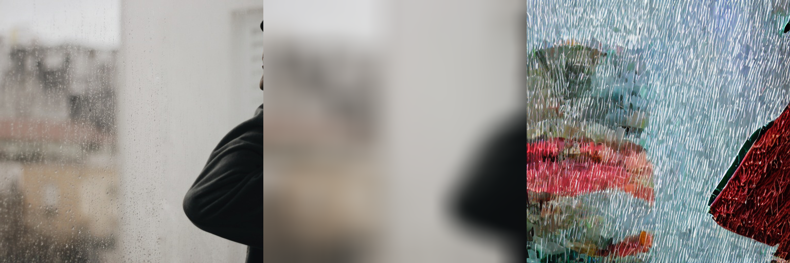
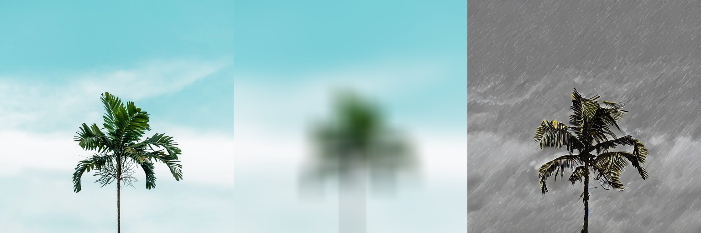

---
license: creativeml-openrail-m
base_model: runwayml/stable-diffusion-v1-5
tags:
- stable-diffusion
- stable-diffusion-diffusers
- text-to-image
- diffusers
- lora
- controlnet
- control-lora
inference: true
---
    
# ControlLoRA text2image fine-tuning - https://huggingface.co/wtcherr/sd-unsplash_5k_blur_61KS-model-control-lora
These are ControlLoRA adaption weights for runwayml/stable-diffusion-v1-5. The weights were fine-tuned on the wtcherr/unsplash_5k_blur_61KS dataset. You can find some example images in the following. 

